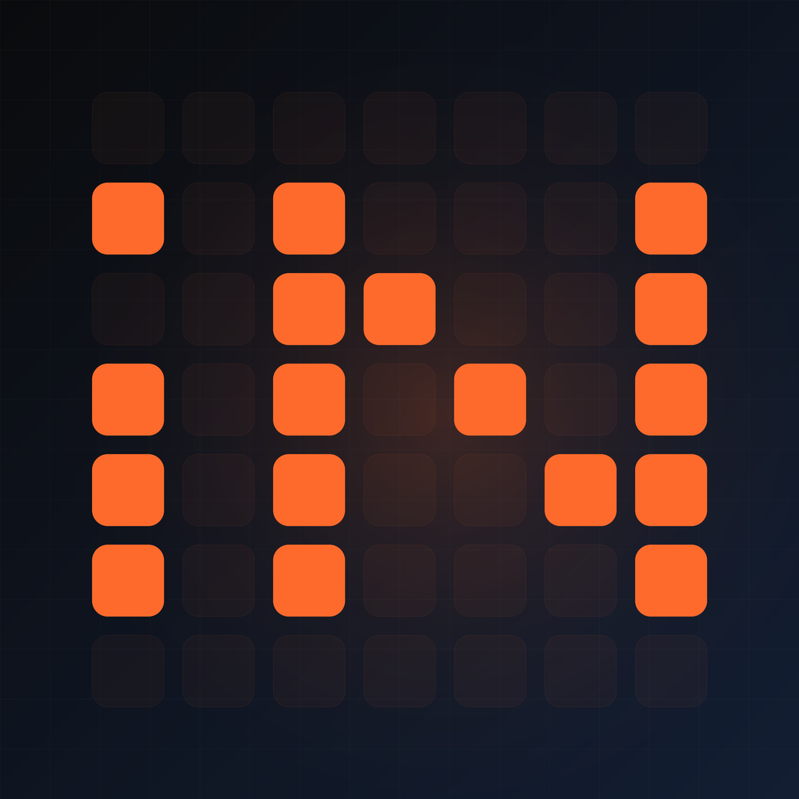
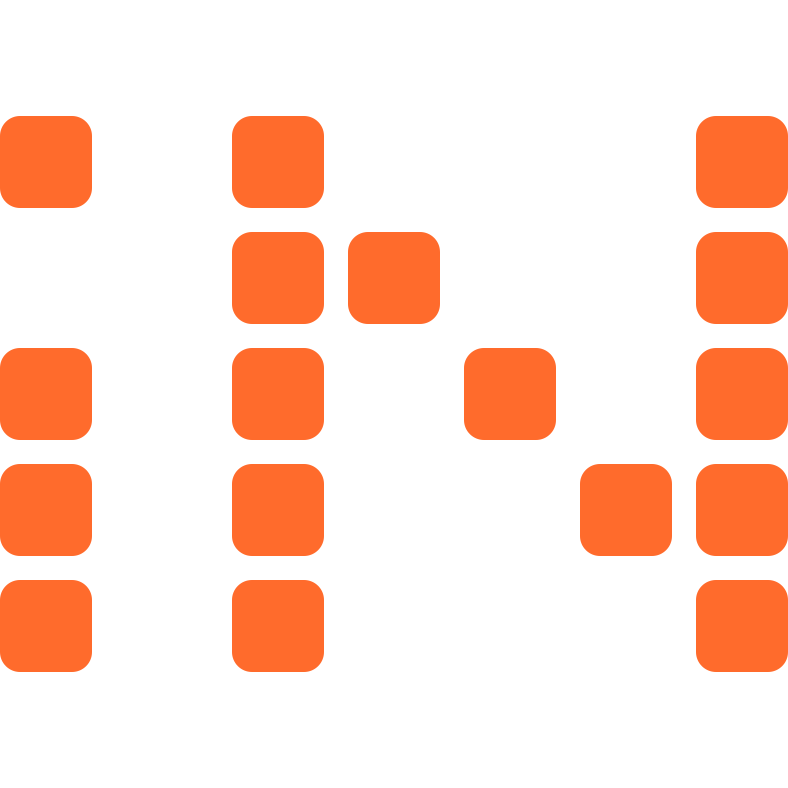
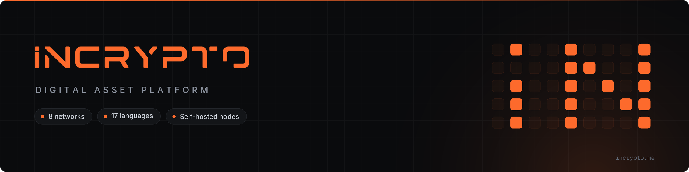

# Brand assets

Assets on this page are for partners, integrators and press. Use them as provided; do not redraw, recolour or distort them.

## Name

The name is written **iNCRYPTO** — lowercase *i*, the rest uppercase — in running text as well as in the wordmark. Do not write "Incrypto", "INCRYPTO" or "inCrypto".

## Wordmark

  

[:material-download: incrypto-wordmark-orange.png](assets/incrypto-wordmark-orange.png){ .md-button }

The wordmark is always set in brand orange on dark or light backgrounds. Keep clear space around it equal to the height of the letter *N*.

## Mark

The mark is the *iN* ligature built from tiles. It is used where the full wordmark does not fit: avatars, favicons, app icons.

  
  

[:material-download: incrypto-mark-dark.png](assets/incrypto-mark-dark.png){ .md-button }
[:material-download: incrypto-mark.svg](assets/incrypto-mark.svg){ .md-button }

## Banner

[:material-download: incrypto-banner.png](assets/incrypto-banner.png){ .md-button }

## Colours

| | Token | Hex | Use |
|---|---|---|---|
|  | Brand orange | `#FF6B2C` | Wordmark, primary actions, accents |
|  | Orange (dark hover) | `#FF7E47` | Hover and links on dark surfaces |
|  | Background | `#0A0B0D` | Page background, dark theme |
|  | Surface | `#131518` | Cards, panels, code blocks |
|  | Sidebar | `#0E0F12` | Navigation surfaces |
|  | Text on dark | `#F5F5F7` | Primary text, dark theme |
|  | Text on light | `#1A1A1A` | Primary text, light theme |
|  | Success | `#22C55E` | Confirmed, settled |
|  | Warning | `#F59E0B` | Pending, attention |
|  | Danger | `#EF4444` | Failed, rejected |
|  | Info | `#3B82F6` | Informational |

## Typography

| Role | Typeface | Weights |
|---|---|---|
| Interface and text | [Inter](https://rsms.me/inter/) | 400, 500, 600, 700, 800 |
| Code, amounts, identifiers | [JetBrains Mono](https://www.jetbrains.com/lp/mono/) | 400, 500 |

Amounts and hashes are set in JetBrains Mono with tabular figures so columns align.

## Do not

- Recolour the wordmark or mark, or place them on busy photographic backgrounds.
- Stretch, rotate, outline or add effects to the assets.
- Combine the wordmark with other logos in a way that implies endorsement without a written agreement.

Questions about usage: [hello@incrypto.me](mailto:hello@incrypto.me).
